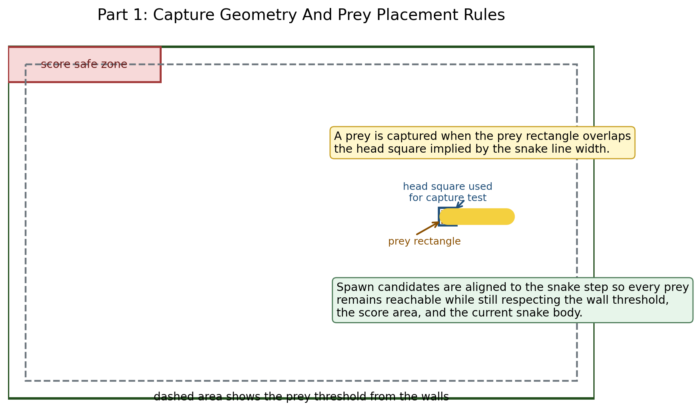

# Group Information

- Group number: `[replace with your group number]`
- Student names: `[replace with student names]`

# Introduction

Part 1 implements a simplified multithreaded snake game using `threading`,
`queue`, and `tkinter`. The provided skeleton already defined the GUI and queue
handler, so the main design task was to complete the `Game` methods in a way
that stayed inside the specification while also making the behavior precise,
testable, and easy to explain.

The final implementation keeps the original structure:

- `Gui` owns the Tkinter window and only renders queue tasks.
- `QueueHandler` is the only code that touches the canvas after startup.
- `Game` owns the snake state, prey state, score, and collision logic.

That division is useful because the game thread only computes state and enqueues
tasks, while the GUI thread remains responsive and only performs drawing.

# Design And Implementation

## Movement And Queue Usage

The snake is represented by `snakeCoordinates`, a list of `(x, y)` tuples. The
head is always the last tuple in the list. Every `0.15` seconds, `superloop()`
calls `move()` from a background thread. `move()` computes one new head
coordinate, updates the list, and then pushes a `{"move": ...}` task to the
FIFO queue so the GUI thread can redraw the line on the canvas.

This keeps the shared state simple:

- the game thread updates Python data structures;
- the queue transfers the new state safely;
- the GUI thread reads the queue and updates the Tkinter widgets.

## Prey Capture Geometry

The project description leaves the capture rule open-ended, so we documented and
implemented a rectangle-overlap rule. The snake is drawn as a Tkinter line with
width `SNAKE_ICON_WIDTH`, which means the visible head occupies a square around
the head center. The prey is a rectangle with width `PREY_ICON_WIDTH`.

A capture happens when these two visible regions overlap. In other words, if the
head square is not completely left, right, above, or below the prey rectangle,
the prey is considered captured.

{ width=95% }

This rule has two advantages:

- it matches what the player sees on screen instead of relying on an invisible
  center point;
- it still works if `PREY_ICON_WIDTH` is changed to another reasonable value.

## Prey Placement

The prey is spawned from a precomputed list of valid candidate centers rather
than through repeated random retries. This avoids unnecessary work and makes the
behavior easier to reason about. A candidate is accepted only if it satisfies
all of the following:

- it stays inside the wall threshold;
- it does not overlap the score display area;
- it does not overlap the current snake body.

The candidates are aligned to the snake step size. This is a practical design
choice: because the snake moves on a 10-pixel grid in the supplied skeleton,
placing prey on the same grid guarantees that every generated prey remains
reachable.

## Collision Detection

Wall collisions are checked with the visible width of the snake, not only with
the head center. If the head square crosses the left, right, top, or bottom
boundary, the game ends.

Self-collision uses a grid-based occupancy test instead of visible rectangle
overlap. This is intentional. The supplied skeleton uses a snake width of `15`
pixels but a movement step of `10` pixels, so a literal rectangle-overlap test
would make an ordinary turn overlap the neck and immediately end the game. The
implemented rule therefore treats a self-hit as the head moving onto a body
coordinate that is already occupied by the snake. That removes the false game
overs while still detecting real body collisions.

# Verification

The implementation was verified in three ways.

1. Syntax validation: `python -m py_compile part1.py part2.py`
2. Targeted logic checks through a non-GUI harness that instantiated `Game`
   directly and verified:
   - normal movement without growth;
   - prey capture, score update, and length growth;
   - wall collision;
   - self-collision;
   - reverse-direction rejection in `whenAnArrowKeyIsPressed()`;
   - prey placement staying away from walls, the score area, and the snake.
3. A short Tkinter smoke test that instantiated the full game, ran the event
   loop briefly, and closed the window automatically to confirm that the GUI
   path starts without runtime errors.
4. Code review of the queue payloads to confirm that the queue handler still
   receives exactly the task shapes required by the specification:
   `{"move": list[tuple[int, int]]}`, `{"prey": (x1, y1, x2, y2)}`,
   `{"score": int}`, and `{"game_over": bool}`.

# Challenges And Future Improvements

The main challenge in Part 1 was that the visible snake width is larger than the
movement step. That makes the geometry less trivial than a center-point-only
snake implementation. It affects prey capture, wall detection, and self-hit
detection. Another challenge was choosing prey locations that are both legal and
reachable while keeping the code efficient.

If this game were extended further, the next improvements would be:

- adding a "victory" condition when no legal prey locations remain;
- adding automated GUI-level tests around the Tkinter event loop;
- improving the game-over presentation and player feedback without changing the
  assignment's required structure.
