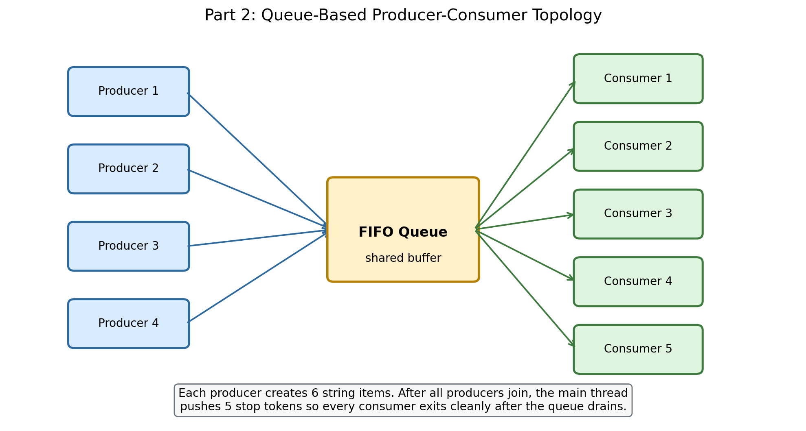

# Group Information

- Group number: `[replace with your group number]`
- Student names: `[replace with student names]`

# Introduction

Part 2 implements a producer-consumer system using only Python's thread-safe
`queue.Queue` as the shared buffer. The assignment explicitly disallows extra
synchronization primitives such as locks or semaphores, so the solution relies
on FIFO ordering, `join()`/`task_done()`, and sentinel values to coordinate all
threads cleanly.

# Design And Implementation

## Thread Layout

The program starts:

- 4 producer threads;
- 5 consumer threads;
- 1 shared FIFO queue.

Each producer creates 6 string items, so a complete run produces exactly 24
items. The strings include the producer name and item number, for example
`Producer-3-item-04`, which makes the console output easy to inspect during
testing.

{ width=95% }

The core configurable constants are shown below.

| Constant | Value | Purpose |
| --- | --- | --- |
| `PRODUCER_COUNT` | `4` | required number of producers |
| `CONSUMER_COUNT` | `5` | required number of consumers |
| `ITEMS_PER_PRODUCER` | `6` | manageable total workload for testing |
| `PRODUCER_DELAY_RANGE` | `0.05` to `0.18` s | randomized production timing |
| `CONSUMER_DELAY_RANGE` | `0.08` to `0.22` s | randomized consumption timing |

## Why The Shutdown Works

The shutdown sequence is the most important design decision in this part.

1. All consumers start first and block on `queue.get()`.
2. Producers generate items and place them into the queue.
3. The main thread waits for every producer with `producer.join()`.
4. After every producer is done, the main thread pushes exactly one stop token
   for each consumer.
5. Because the queue is FIFO, every real item already in the queue is consumed
   before a later stop token can be processed.
6. Every consumer calls `task_done()` both for normal items and for the stop
   token, so `buffer.join()` does not return until the queue is truly drained.

This gives a deterministic and graceful ending without using any forbidden
primitive.

## Queue-Only Coordination

The implementation intentionally avoids any shared counter protected by locks.
The queue is the synchronization mechanism:

- producers only `put()` items;
- consumers only `get()` items and acknowledge them with `task_done()`;
- the main thread uses `join()` to wait for producer completion and queue drain.

This keeps the program aligned with the project rules and avoids race-condition
risks that would come from manually synchronizing extra shared state.

# Verification

The program was checked with the same compilation command used for Part 1:

`python -m py_compile part1.py part2.py`

It was then executed directly with `python part2.py`. One recorded verification
run produced the following outcomes:

- 24 produced-item log lines;
- 24 consumed-item log lines;
- 5 consumer stop-signal log lines;
- 4 producer completion log lines;
- 5 consumer shutdown log lines;
- final summary line confirming that 24 items were produced and consumed.

These checks confirm that the queue drains correctly, no produced item is lost,
and every consumer terminates cleanly after receiving its stop token.

# Challenges And Future Improvements

The main challenge in Part 2 is ending the program cleanly without extra
synchronization primitives. A naive approach can easily deadlock or leave daemon
threads running in the background. Using one sentinel per consumer solves this
while keeping the program faithful to the queue-based design required by the
assignment.

If this program were extended beyond the assignment, useful next steps would be:

- collecting per-thread statistics for throughput analysis;
- experimenting with different queue sizes and delay ranges;
- redirecting the console trace to a structured log for larger experiments.
